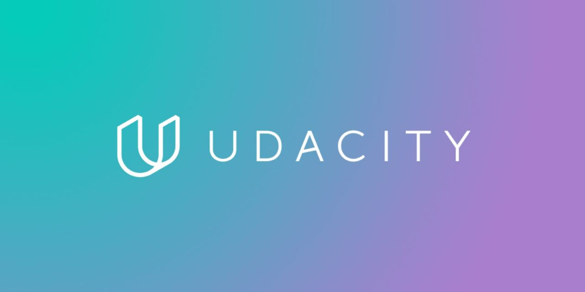
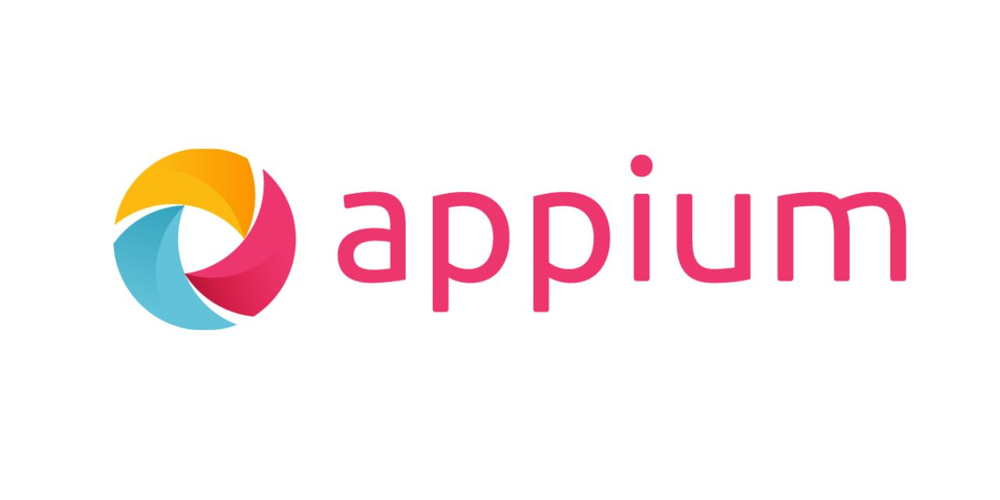

# 👋 Hi there, I'm Mohammed Lukmanudhin

## 🚀 About Me

Automation Test Engineer with expertise in healthcare domain software testing. Passionate about creating efficient, reliable test automation frameworks and solutions that enhance software quality.

- 🔭 I'm currently working on advanced test automation solutions using Playwright, TypeScript, and Selenium Java
- 🌱 I'm continuously learning about new testing methodologies and tools
- 💬 Ask me about test automation, API testing, and CI/CD integration

## 🛠️ Technical Skills

### Programming Languages

### Testing Frameworks & Tools

### API Testing

### DevOps & Tools

## 🚀 Featured Projects

<table>
  <tr>
    <td width="50%">
      <h3 align="center">Amazon E2E Tests with Cucumber</h3>
      

        
        

          
        

        
<strong>Java, Selenium WebDriver, TestNG, Cucumber, Maven, POM</strong> - Built BDD framework with Cucumber and Selenium for web app testing, using Page Object Model and Maven for multi-browser tests.

      

    </td>
    <td width="50%">
      <h3 align="center">Emirates E-Commerce Test Framework</h3>
      

        
        

          
        

        
<strong>Java, Selenium, Rest Assured, Allure, TestNG, Maven, POM, Postman</strong> - Created test framework for Emirates ecommerce, integrating Selenium and RestAssured for UI/API tests with Allure reports.

      

    </td>
  </tr>
  <tr>
    <td width="50%">
      <h3 align="center">Udacity Catalog BDD Framework</h3>
      

        
        

          
        

        
<strong>TypeScript, Playwright, Cucumber(BDD), API Testing, JS, POM</strong> - Developed BDD framework for Udacity Catalog with Playwright and TypeScript, featuring UI/API tests and Allure reports.

      

    </td>
    <td width="50%">
      <h3 align="center">Appium Mobile Testing Framework</h3>
      

        
        

          
        

        
<strong>Java, Appium, TestNG, Page Object Model(POM)</strong> - Built mobile test framework for General Store Android app using Appium and Java, with POM for scalable UI testing.

      

    </td>
  </tr>
  <tr>
    <td width="50%">
      <h3 align="center">Flipkart E-commerce Test Framework</h3>
      

        
        

          
        

        
<strong>Java, Selenium WebDriver, Extent Report, TestNG, Maven, POM</strong> - Designed Selenium framework for Flipkart ecommerce testing with Java and TestNG, using Extent Reports for results.

      

    </td>
    <td width="50%">
      <h3 align="center">SauceLabs UI Automation Testing</h3>
      

        
        

          
        

        
<strong>Java, Selenium, TestNG, Allure, Maven, POM</strong> - Automated testing for SauceDemo's shopping cart functionality using Selenium WebDriver, TestNG, and POM. Supports parallel execution and cross-browser testing with Allure Reporting.

      

    </td>
  </tr>
</table>

## 📜 Certifications

- Internship in Software Testing (Pantech e Learning)
- Data Analytics Using Python (CIRF)
- ISTQB Certified Tester (In Progress)

## 🏆 Key Achievements

- Reduced test execution time by 60% by implementing storage state in Playwright
- Designed innovative OTP verification solutions using API onboarding and disposable mailbox services
- Enhanced test parallelization with multiple dynamic mailbox services
- Achieved 95% test automation coverage for critical healthcare platform features
- Reduced critical post-release issues by 40% through improved QA practices

## 📚 Education

- **Master of Computer Science** (2022-2024)  
  The New College, University of Madras, Chennai
  
- **Bachelor of Computer Science** (2019-2022)  
  The New College, University of Madras, Chennai

## 📊 GitHub Stats

  

## 📈 My GitHub Activity

  

## 🤝 Let's Connect!

I'm always interested in collaborating on innovative testing projects. Feel free to reach out!

📞 Phone: +91 7338818184  
✉️ Email: lukmanudhinm@gmail.com  
💼 LinkedIn: [linkedin.com/in/lukmanudhin](https://www.linkedin.com/in/lukmanudhin)  
🌐 Portfolio: [redjavaman.github.io/Lukmanudhin_Portfolio](https://redjavaman.github.io/Lukmanudhin_Portfolio/)
